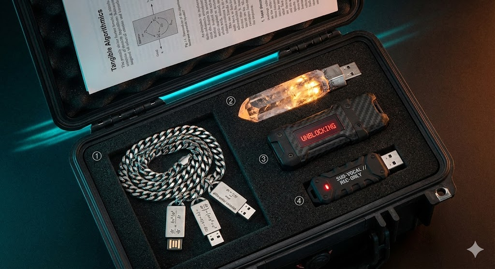
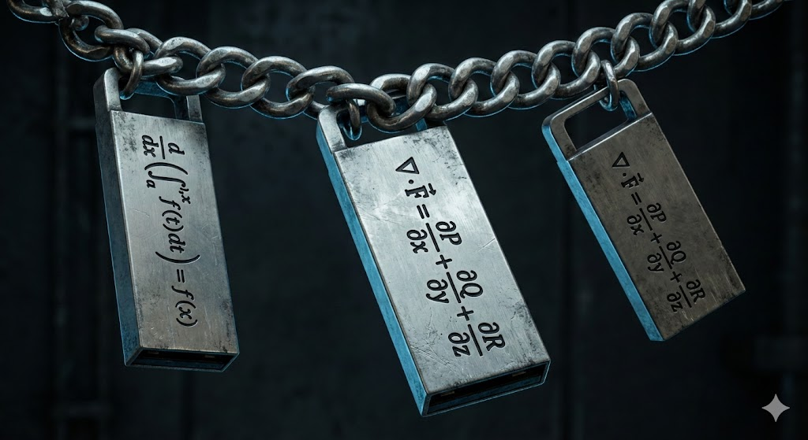
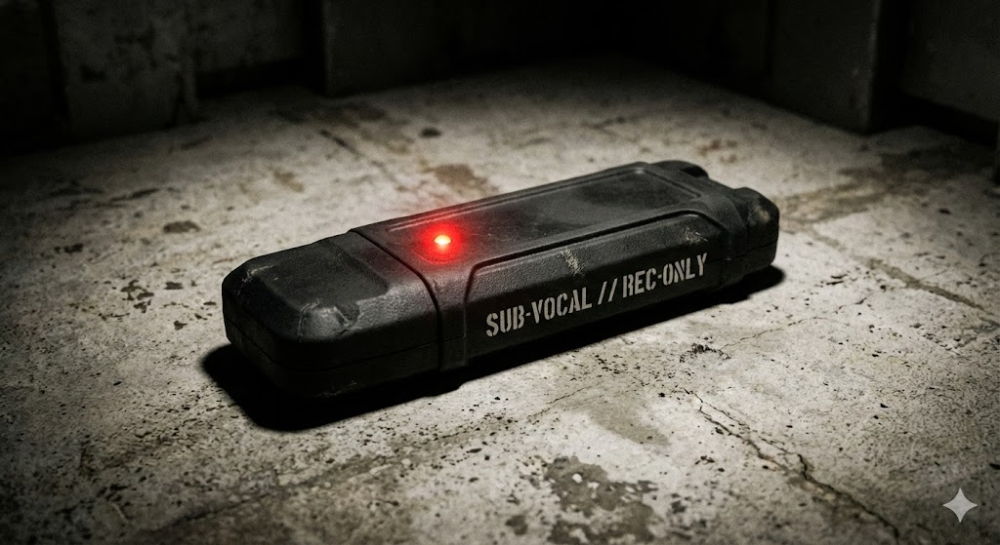
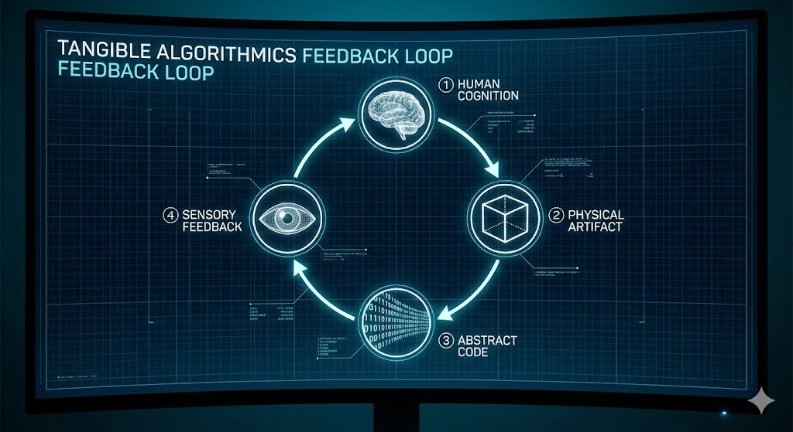

<div align="center">

# THE UNORTHODOX ARTIFACTS
### TANGIBLE ALGORITHMICS • DIEGETIC PROTOTYPING • DARK RESEARCH AESTHETICS


[](./hci_paper.pdf)
[]()
[-yellow?style=for-the-badge&logo=latex)](#-build-the-hci-paper)
[]()
[]()

*As submitted to MIT Press (Leonardo Journal), 2025.*

</div>

---

## 🧭 Table of Contents
- [📜 The Manifesto](#-the-manifesto)
- [🖼️ Gallery](#%EF%B8%8F-gallery)
- [📦 The Artifacts](#-the-artifacts)
- [⚡ Quickstart](#-quickstart)
- [🗂️ Repo Map](#%EF%B8%8F-repo-map)
- [🧪 Build the HCI Paper](#-build-the-hci-paper)
- [🧠 Algorithms Inside](#-algorithms-inside)
- [🛡️ Ethics & Safety](#%EF%B8%8F-ethics--safety)
- [❓ FAQ](#-faq)
- [🔖 Citation](#-citation)
- [📄 License](#-license)
- [✉️ Contact](#%EF%B8%8F-contact)

---

## 📜 THE MANIFESTO
We live in an era of "Invisible Computation." We believe code should have **weight**.
This collection physicalizes abstract mathematical dynamics—Chaos Theory, Liquid Neural Networks, and Entropy—into functional, heavy-metal interfaces.

**These are not just USB drives. They are Talismans of Logic.**

By placing algorithms into hand-made, high-mass forms, we invite a tactile relationship with abstraction. Each artifact is a field guide from the future—equal parts instrument, sculpture, and research probe.

---

## 🖼️ Gallery

<div align="center">

| | | |
|---|---|---|
|  |  |  |
| <em>Collector's Set</em> | <em>Q-PID</em> | <em>Isochron Key</em> |
|  |  |  |
| <em>Aspect Interface</em> | <em>Mnemonic Key</em> | <em>System Diagram</em> |

</div>

---

## 📦 THE ARTIFACTS

### 1) THE Q-PID (LIQUID INTELLIGENCE)

> *"A brain that you can hold."*

- **Material:** Zinc Alloy & Brushed Titanium
- **Payload:** **NATURA Framework** (Neural Circuit Policies)
- **Function:** Portable Liquid Neural Network environment. The chains express sparse synaptic wiring and dynamic state flow.

### 2) THE ISOCHRON KEY (DETERMINISTIC CHAOS)

> *"See the timeline fracture."*

- **Material:** Optical Glass & Raw Quartz
- **Payload:** **Lorenz Attractor Solver** (Monte Carlo Simulation)
- **Function:** Simulates the Butterfly Effect. Provide a micro-perturbation and watch future-state trajectories diverge across 1,000 steps.

### 3) THE ASPECT INTERFACE (DEPROGRAMMING)

> *"The machine that speaks back."*

- **Material:** Carbon Fiber Composite & IPS Screen
- **Payload:** **Psychotronic Counter-Measure**
- **Function:** High-frequency visual flash sequences (~40 ms) to disrupt cognitive ruts and invite reframing.

### 4) THE MNEMONIC KEY (BIO-LOGGING)

> *"Record everything. Forget nothing."*

- **Material:** Rubberized Mil-Spec Polymer
- **Payload:** **Thought Transcription Engine**
- **Function:** Conceptual passive-logging interface for externalized cognition.

---

## ⚡ Quickstart

```bash
# 1) Clone
git clone https://github.com/your-org/your-repo.git
cd your-repo

# 2) Generate/refresh the README (optional)
python GENERATE_ARTIFACT_README.py

# 3) Open the paper
start hci_paper.pdf  # Windows
# open hci_paper.pdf  # macOS
# xdg-open hci_paper.pdf  # Linux
```

---

## 🗂️ Repo Map

```
F:/code/missions/Q-PID/
├─ GENERATE_ARTIFACT_README.py   # Writes this README
├─ GENERATE_HCI_PAPER*.py        # Paper generation scripts
├─ hci_paper.tex                 # LaTeX source of the paper
├─ hci_paper.pdf                 # Compiled paper (prebuilt)
├─ images/                       # High-res artifact imagery
│  ├─ THE FULL COLLECTOR'S SET.jpg
│  ├─ THE ASPECT 23 KEY (The Deprogrammer).jpg
│  ├─ THE ISOCHRON KEY (The Time Telescope).jpg
│  ├─ THE MNEMONIC KEY (The Bio-Logger).jpg
│  └─ q-pid liquid intelligence concept.jpg
├─ fig1_collection.jpg           # Inline figures for README
├─ fig2a_qpid.jpg
├─ fig2b_isochron.jpg
├─ fig3a_aspect.jpg
├─ fig3b_mnemonic.jpg
├─ fig4_diagram.png
└─ tectonic.exe                  # Portable LaTeX engine (Windows)
```

---

## 🧪 Build the HCI Paper

You can reproduce the PDF locally. We include a portable LaTeX engine for Windows.

- Windows (PowerShell):
  ```powershell
  .	ectonic.exe .\hci_paper.tex
  ```
- macOS/Linux (requires TeX Live or Tectonic):
  ```bash
  tectonic hci_paper.tex  # or
  pdflatex hci_paper.tex && bibtex hci_paper && pdflatex hci_paper.tex && pdflatex hci_paper.tex
  ```

The result will be `hci_paper.pdf` in the project root.

---

## 🧠 Algorithms Inside

- **Liquid Neural Networks (NCPs / NATURA)**
  - Sparse, stateful recurrent cells capable of continuous-time adaptation.
  - Useful for time-series, control, and embodied intelligence.
- **Lorenz Attractor (Deterministic Chaos)**
  - Classic chaotic system with sensitive dependence on initial conditions.
  - Monte Carlo perturbations visualize trajectory divergence.
- **Perceptual Flash Protocols (Visual Routines)**
  - Rapid temporal patterning designed to disrupt habitual attention and invite exploration.
- **Cognitive Externalization (Mnemonic Ledger)**
  - Speculative interface for logging thought prompts and associations.

> This repository focuses on artistic research and HCI prototyping. Implementations are simplified and designed for demonstration.

---

## 🛡️ Ethics & Safety
- These artifacts are **art/research prototypes**. They are not medical devices and make **no therapeutic, diagnostic, or surveillance claims**.
- Do not operate visual flash sequences if you are photo‑sensitive or advised to avoid strobing stimuli.
- Respect privacy: any logging mechanism should be used with explicit consent and local, secure storage.

---

## ❓ FAQ
**Are these real objects?**  Yes—functional prototypes with working payloads where noted.

**Can I buy one?**  Limited runs may be produced. For inquiries, reach out below.

**Can I contribute code or research?**  PRs and issues are welcome—especially for reproducibility, simulation improvements, and documentation.

---

## 🔖 Citation
If you reference this work, please cite the paper:

```
@inproceedings{unorthodox2025tangible,
  title     = {Tangible Algorithmics: Physicalizing Abstract Mathematical Dynamics},
  author    = {Department of Unorthodox Engineering},
  year      = {2025},
  booktitle = {Proceedings / Leonardo (MIT Press) — Submission},
  url       = {https://github.com/your-org/your-repo/hci_paper.pdf}
}
```

---

## 📄 License
Unless otherwise noted:
- Code and text are released under **MIT (Leonardo)**.
- Images/renderings are provided for research and documentation; check provenance before commercial reuse.

---

## ✉️ Contact
- Department of Unorthodox Engineering
- "The Future is Unwritten, but it is Deterministic."

<div align="center">

— END OF DOSSIER —

</div>
